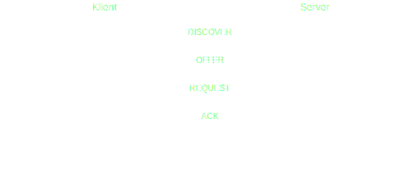

## MPC-SSY Projekt | 

Tato dokumentace popisuje modul `app` (`app.h` a `app.c`) P2P (peer-to-peer) síťové aplikace. Poskytuje přehled účelu modulu, datových struktur, stavového automatu, API funkcí a detailů implementace.

### 1. Přehled modulu

Modul `app` implementuje aplikační logiku pro komunikaci peer-to-peer nad síťovou (NWK) a fyzickou (PHY) vrstvou. Zajišťuje:

* Inicializaci parametrů aplikace a síťových nastavení.
* Odesílání a přijímání zpráv mezi uzly (klienty a serverem).
* Údržbu směrovací tabulky pro klientské uzly (na serveru).
* Zpracování UART I/O pro ladění a logování dat.
* Periodické úlohy řízené časovačem (flush timer).

Modul může pracovat ve dvou rolích, určovaných makrem `DESIGNATION` v `config.h`:

* **Klient** (`DESIGNATION=1`): Iniciuje objevování, žádá o přiřazení adresy, odesílá data serveru.
* **Server** (`DESIGNATION=0`): Nabízí přiřazení adres, udržuje směrovací tabulku, přijímá a loguje data od klientů.

Tohle makro existuje pouze pro nároky představení projektu, klientský kód by v reálné aplikaci byl výrazně závislý na zařízení a nárocích implementace.

### 2. Přehled souborů

#### 2.1 `app.h`

Definuje veřejné rozhraní a základní datové typy modulu aplikace.

* **Výčtové typy**:

  * `AppState_t`: Stavový automat aplikace (`INIT`, `IDLE`).
  * `AppMsgType_t`: Typy aplikačních zpráv (`ACK/NACK`, `DISCOVER`, `OFFER`, `REQUEST`, `APPDATA`, atd.).
  * `SensorType_t`: Typy senzorů (např. `WEIGHT_SENSOR`, `OTHER`).

* **Struktury**:

  * `AppMsg_t`: Kontejner zprávy, obsahuje hlavičku (velikost, typ, sleep flag) a ukazatel na data.
  * `RouteTable_t`: Položka směrovací tabulky (adresa, endpoint, typ senzoru, sleep status, značka použitelnosti).

* **Konstanty a makra**:

  * `APP_HEADER_SIZE`, `DEBUG_PRINT` a makra pro velikosti bufferů.

* **API funkce**:

  * `void APP_init(void)`: Inicializuje aplikaci a síť.
  * `void APP_timerHandler(SYS_Timer_t *timer)`: Obsluha periodického časovače.
  * `bool APP_dataRecv(NWK_DataInd_t *ind)`: Callback pro příchozí síťová data.
  * `void APP_dataConf(NWK_DataReq_t *req)`: Callback po dokončení přenosu.

#### 2.2 `app.c`

Implementuje aplikační logiku deklarovanou v `app.h`.

* **Globální proměnné**:

  * `static AppState_t appState`: Aktuální stav stavového automatu.
  * `static SYS_Timer_t timer`: Časovač pro periodické flush úlohy.
  * `static NWK_DataReq_t dataReq`: Struktura pro síťové požadavky na odeslání.
  * `static bool dataReqBusy`: Příznak obsazenosti požadavku.
  * Buffery pro data payload, UART I/O a sestavování zpráv.
  * `static RouteTable_t routeTable[ROUTE_TABLE_SIZE]`: Položky směrovací tabulky.
  * `static uint8_t routeTablePtr`: Ukazatel/index do tabulky.

* **Klíčové funkce**:

  * `APP_TaskHandler`: Řídí stavový automat, aktuálně pouze `INIT` volá `APP_init()`.
  * `main`: Inicializuje systém (SYS) a UART, vstupuje do nekonečné smyčky voláním task handlerů.
  * `HAL_UartBytesReceived`: UART RX hook pro echo přijatých bajtů.
  * `APP_dataSend`: Sestavuje a odesílá aplikační zprávy (OFFER nebo APPDATA) podle typu.
  * `APP_pushAddr`: Vkládá novou položku do směrovací tabulky; vrací index slotu.
  * `APP_dataRecv`: Zpracovává příchozí zprávy; chování se liší pro klienta a server:

    * **Klient**: Zpracovává `RELEASE`, `OFFER`, `REQUEST_DATA` zprávy, odesílá ACK nebo APPDATA.
    * **Server**: Zpracovává zprávy od klientů (`DISCOVER`, `DECLINE`, `REQUEST`, `APPDATA`, `APP_SLEEP`, `RECONNECT`), aktualizuje směrovací tabulku a UART logy, posílá odpovědi.
  * `APP_dataConf`: Volá se po dokončení síťového odeslání; uvolní flag obsazenosti.
  * `APP_timerHandler`: Callback časovače pro periodický flush, zapisuje testovací řetězec do UART.
  * `APP_init`: Konfiguruje síťovou adresu, PAN ID, kanál, otevírá endpoint, inicializuje board a časovač, a pokud je klient, ihned odesílá `DISCOVER`.

### 3. Stavový automat aplikace

Aplikační modul využívá jednoduchý dvoustavový automat:

1. **INIT**: Při startu volá `APP_init()`, poté přechází do stavu `IDLE`.
2. **IDLE**: Rezervní stav pro budoucí logiku; periodické úlohy běží přes callback časovače.

### 4. Tok zpráv

1. **Start klienta**: V `APP_init` klient odešle `DISCOVER` serveru.
2. **Objevování na serveru**:

   * Server přijme `DISCOVER`, přidělí adresu funkcí `APP_pushAddr`, odešle `OFFER` s navrženým indexem adresy.
3. **Zpracování OFFER na klientovi**:

   * Klient přijme `OFFER`, odešle `REQUEST` pro potvrzení.
4. **Zpracování REQUEST na serveru**:

   * Server po obdržení `REQUEST` označí položku tabulky jako používanou a odešle `APP_ACK`.
5. **Výměna Dat**:

   * Server může požadovat data přes `REQUEST_DATA`; klient odpoví `APPDATA` s payload.
   * Klient může také iniciovat odeslání přes `APPDATA`, když je potřeba.
6. **Režim spánku/probuzení**:

   * Klient informuje server zprávou `APP_SLEEP` a `RECONNECT`; server aktualizuje flag `sleeping`.

### 5. Integrace s dalšími vrstvami

* **Síťová vrstva**: Používá `NWK_DataReq_t`, `NWK_SetAddr`, `NWK_OpenEndpoint` a další API z `nwkDataReq.h`, `nwkRx.h`.
* **Fyzická vrstva**: Konfigurace přes `PHY_SetChannel`, `PHY_SetRxState`.
* **Systém a UART**: `SYS_Init`, `SYS_TaskHandler`, `HAL_UartInit`, `HAL_UartTaskHandler`, `HAL_UartWrite*`.
* **Časovač**: `SYS_Timer_t` s módem `SYS_TIMER_INTERVAL_MODE`.

### 6. Konfigurace

Konfigurace jsou definovány v `config.h` (např. `APP_ADDR`, `APP_PANID`, `APP_ENDPOINT`, `APP_FLUSH_TIMER_INTERVAL`, `DESIGNATION`, parametry kanálu). Makra určují roli, adresy, nastavení sítě a debug výstup.

### 7. Budoucí rozšíření

* Rozšířit stavový automat o další úlohy v stavu `IDLE`.
* Implementovat `APP_dataOut` a `APP_msgCreate` pro strukturovanou sestavu zpráv.
* Přidat bezpečnostní a směrovací politiky pomocí `NWK_ENABLE_SECURITY`.
* Vylepšit správu směrovací tabulky (např. expirace položek, omezení počtu klientů).

